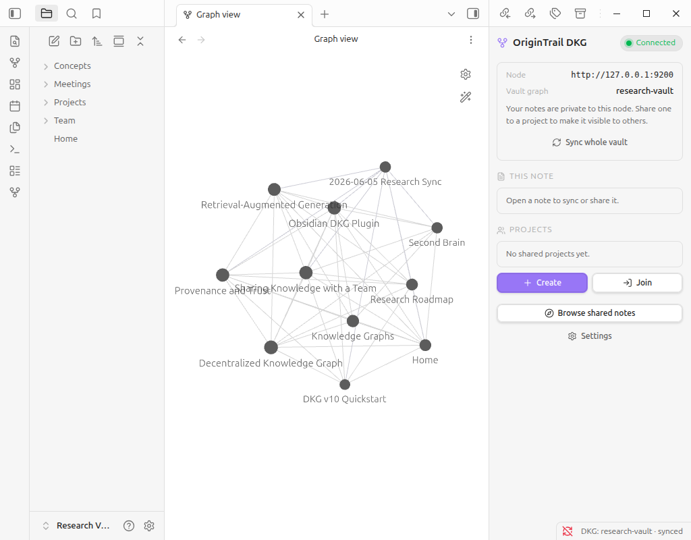
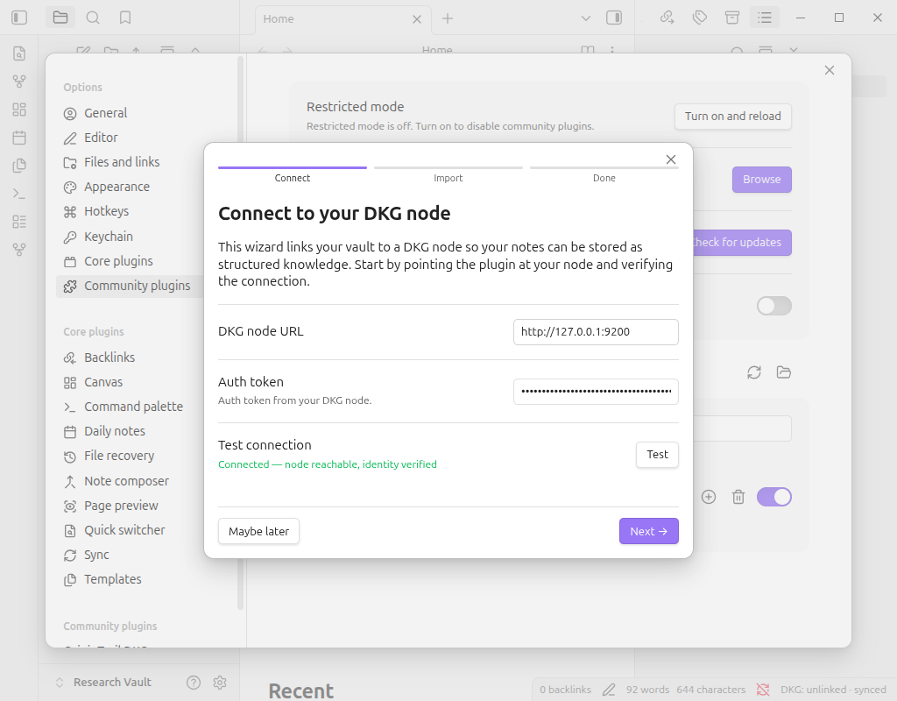
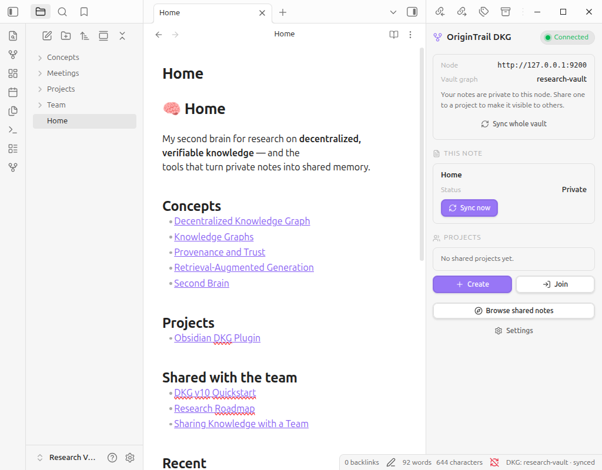
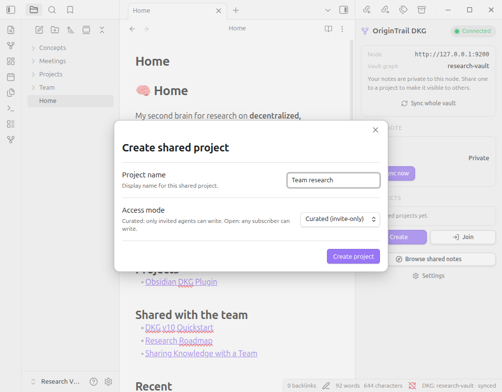

<div align="center">

# OriginTrail DKG for Obsidian

**Turn your Obsidian vault into a verifiable, shareable knowledge graph.**

Sync your Markdown notes into a local [OriginTrail DKG v10](https://github.com/OriginTrail/dkg) node: private by default, with explicit, per-note sharing into collaborative projects.

[](https://github.com/jakepel03/obsidian-dkg-plugin/actions/workflows/ci.yml)
[](LICENSE)




</div>

> [!WARNING]
> DKG v10 is release-candidate software on testnet. Expect iteration and breaking
> changes. Use this plugin for testing and demos, not production-critical knowledge.

---

## Table of contents

- [Why use it?](#why-use-it)
- [Features](#features)
- [Requirements](#requirements)
- [Installation](#installation)
- [Getting started](#getting-started)
- [How it works](#how-it-works)
- [Commands](#commands)
- [Settings](#settings)
- [Development](#development)
- [DKG API surface](#dkg-api-surface)
- [Privacy & safety](#privacy--safety)
- [Roadmap](#roadmap)
- [License](#license)

---

## Why use it?

Obsidian is already one of the best tools for building a personal knowledge base:
a second brain where notes, ideas, and references compound over time.

This plugin takes that further. It connects your local-first vault to the
OriginTrail **Decentralized Knowledge Graph**, so selected knowledge can become
structured, linked, provenance-aware memory that humans and AI agents can
discover, verify, and build on together.

> Intelligence is power. Intelligence shared is power multiplied.

You keep writing in Obsidian. The DKG becomes the trust and knowledge-graph layer
underneath, and you decide, note by note, what stays private and what gets shared.

## Features

- 🧠 **Vault → knowledge graph**: every Markdown note is imported into a DKG project named after your vault.
- 🔒 **Private by default**: notes live only on *your* node until you explicitly share them.
- 🔁 **Live auto-sync**: edits, creates, renames, and deletes are mirrored to the DKG (debounced, not on every keystroke).
- 🤝 **Per-note & per-folder sharing**: share an individual note to a project, or route a whole folder to one automatically.
- 🌐 **Collaborative projects**: create or join shared projects (context graphs) and manage members.
- 🔎 **Discover**: browse notes others have shared into a project you're subscribed to.
- 📊 **Dashboard & status bar**: see your project, sync state, and project readiness at a glance.
- 🪄 **Guided setup**: a 3-step wizard handles connection and the first import.

## Requirements

- **[Obsidian](https://obsidian.md/download)** 1.5.0 or newer.
- A **local OriginTrail DKG v10 node**, up and running and reachable by the plugin (default `http://127.0.0.1:9200`), plus its **auth token**.

Installing and running the node is covered in the **[OriginTrail DKG repo](https://github.com/OriginTrail/dkg)**. Once it's running, grab its base URL and auth token; that's all the plugin needs to connect.

## Installation

> A Community Plugins / BRAT listing is on the [roadmap](#roadmap). For now, install
> directly from this repo: the built plugin (`main.js`, `manifest.json`,
> `styles.css`) is committed and kept current by CI, so **no build step is needed.**

### Option A: one command (recommended)

From a clone of this repo, point `install` at your vault:

```bash
make install VAULT="/path/to/your vault"
```

This copies the plugin into `<vault>/.obsidian/plugins/origintrail-dkg/`. Then enable
it in Obsidian under **Settings → Community plugins** (turn off Restricted mode if asked).

### Option B: manual

1. Download `main.js`, `manifest.json`, and `styles.css` from this repo.
2. Copy them into your vault at:

   ```text
   <your vault>/.obsidian/plugins/origintrail-dkg/
   ```

3. In Obsidian, go to **Settings → Community plugins** and enable **OriginTrail DKG**.

> If you don't see the plugin, confirm the folder is named exactly `origintrail-dkg`
> with the three files directly inside it, then fully restart Obsidian.

## Getting started

The first time you open a vault with the plugin enabled, a **setup wizard** runs
(you can re-open it any time with the command **Connect this vault to OriginTrail DKG**):

1. **Connect**: enter your DKG node URL and auth token, then **Test** the connection.
2. **Import**: links a DKG project to your vault and imports all existing Markdown notes into it.
3. **Done**: auto-sync is now on. Everything is private to your node until you share a note.

<div align="center">

</div>

## How it works

**Your vault, your graph.** Powering up creates a DKG project (context graph) named
after your vault and imports your notes into it. This graph is private to your own node.

<div align="center">

</div>

**Edits keep it fresh.** Once auto-sync is on, saving a note re-imports it after a short
debounce, so the graph tracks your latest writing without syncing on every keystroke.

**Sharing is explicit.** Nothing leaves your node automatically. You choose what to share:

- **Per note**: *Share current note to a project* writes a `shared_to` marker in the note's frontmatter and pushes a copy to that project.
- **Per folder**: define folder → project rules so notes under a folder are shared to a project automatically.
- **Stop anytime**: *Stop sharing current note* makes it private again.

**Collaborate.** Create a project to share into, or join someone else's. Subscribed
projects show their sync/readiness state, and **Discover** lets you browse notes others
have shared into a project you've joined.

<div align="center">

</div>

## Commands

All commands are available from the command palette under the **OriginTrail DKG** prefix.

| Command | What it does |
| --- | --- |
| Open DKG dashboard | Open the dashboard panel in the right sidebar (also the ribbon icon). |
| Test DKG connection | Verify the plugin can reach your node with the current credentials. |
| Connect this vault to OriginTrail DKG | Launch the 3-step setup wizard. |
| Sync current note to DKG | Manually sync the active note. |
| Create shared DKG project | Create a new shared project (context graph). |
| Join shared DKG project | Join / subscribe to an existing project. |
| Discover shared notes from a project | Browse notes shared into a subscribed project. |
| Share current note to a project | Share the active note to a chosen project. |
| Stop sharing current note | Make the active note private again. |

## Settings

Open **Settings → OriginTrail DKG**:

| Setting | Description |
| --- | --- |
| DKG node URL | Base URL of your local node (default `http://127.0.0.1:9200`). |
| Auth token | Token from your DKG node (stored only in this vault's local plugin data). |
| Auto-sync | Mirror note changes to the DKG automatically. |
| Sync debounce | How long to wait after an edit before syncing (default 1.5s). |
| Your projects | Projects you've created or joined, with owner/member roles. |
| Folder rules | Folder → project routing for automatic per-folder sharing. |

## Development

```bash
pnpm install
pnpm build      # type-check + production build → main.js
pnpm test       # Vitest suite
pnpm lint       # ESLint
pnpm format     # Prettier (writes)
```

The [Makefile](Makefile) bundles the everyday tasks (run `make` for the full list):

| Target | Description |
| --- | --- |
| `make install VAULT="…"` | Copy the committed build into a vault (no rebuild). |
| `make build` | Type-check + production build. |
| `make dev` | esbuild watch (rebuilds on save). |
| `make deploy` | Build + copy into local `DKG-testing*` vaults (with hot-reload marker). |
| `make test` / `make lint` / `make format` | Test, lint, format. |

The build emits exactly the three files Obsidian loads: `main.js`, `manifest.json`,
and `styles.css`. `main.js` is committed and CI fails if it drifts from source, so run
`pnpm build` and commit the result when you change `src/`.

## DKG API surface

<details>
<summary>HTTP endpoints this plugin calls on the DKG node</summary>

- `GET  /api/status`: node health / connection test
- `GET  /api/agent/identity`: local agent identity
- `GET  /api/context-graph/list`: list context graphs (projects)
- `POST /api/context-graph/create`: create a project
- `POST /api/context-graph/subscribe`: subscribe to a project
- `POST /api/context-graph/{id}/request-join`, `/sign-join`, `/approve-join`, `/join-requests`: join flow
- `GET  /api/context-graph/{id}/participants`, `POST .../add-participant`, `.../remove-participant`: membership / allowlist
- `POST /api/assertion/{name}/import-file`: import a note as an assertion (Markdown upload)
- `GET  /api/assertion/{name}/extraction-status`: extraction progress
- `POST /api/assertion/{name}/promote`: promote an assertion to shared memory
- `POST /api/assertion/{name}/discard`: remove an assertion (cleanup on rename / delete)
- `POST /api/assertion/semantic-enrichment/write`: append resolved-wikilink triples with provenance
- `POST /api/assertion/import-artifact/read-markdown`: read back an imported note's original Markdown (Discover)
- `POST /api/query`: read-only SPARQL query

</details>

## Privacy & safety

- Notes are imported into your **own node's** vault graph and stay private there.
- Sharing is **opt-in and explicit**, per note or per folder; nothing is published automatically.
- The DKG auth token is stored only in the vault's local plugin data, never transmitted elsewhere.
- On-chain / verified publishing is intentionally out of scope for this beta.

## Roadmap

- GitHub Release with prebuilt assets + [BRAT](https://github.com/TfTHacker/obsidian42-brat) install.
- Obsidian Community Plugins submission.
- Friendlier in-plugin DKG token discovery.

## License

[MIT](LICENSE) © Jaka Pelko
